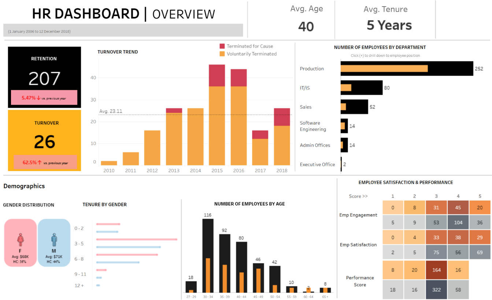
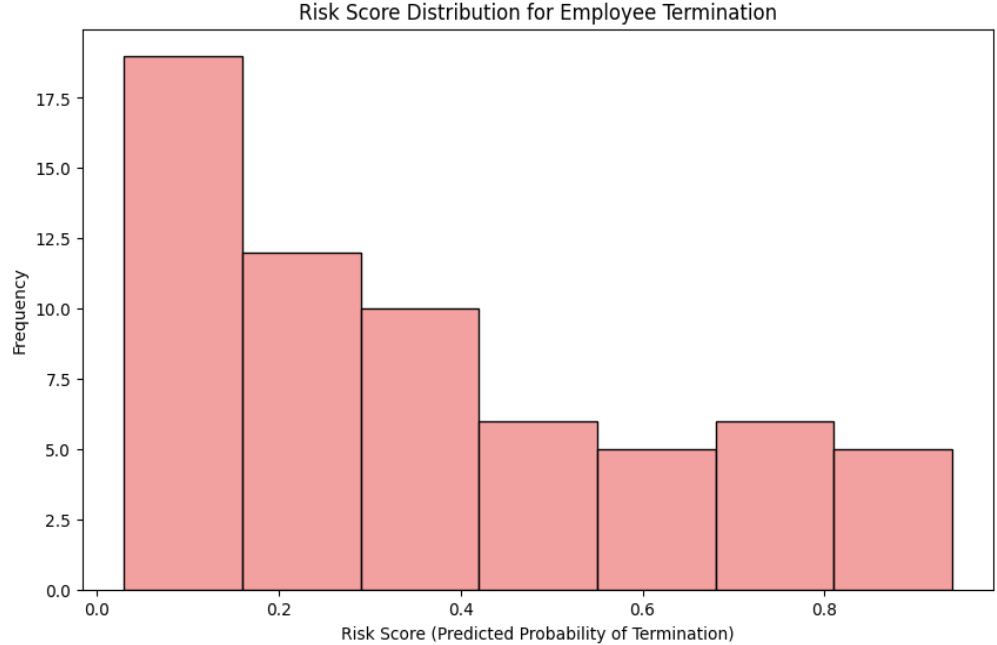

# Human Resources/People Analytics 

* This repository leverages a straightforward machine learning model to predict employee termination status while incorporating statistical testing to address key business questions and uncover insights into organizational health.
The dataset used is Kaggle's "Human Resources Dataset" [(https://www.kaggle.com/datasets/rhuebner/human-resources-data-set)], a rich source of information containing diverse features that can be used to gather meaningful analysis and insight.

## Overview

* People analytics is very important for organizations and shareholders because it provides actionable insights into workforce dynamics, that enable leaders to make data-driven decisions for business success.
* The Kaggle task involves identifying key performance indicators (KPIs) that can benefit a company while developing a predictive model to determine whether an employee will be terminated. This project explores several critical business questions, including:

  - **Turnover and Retention:** What are the turnover and retention rates? What is the company's overall net growth?
  - **Employee Satisfaction and Performance:** Is there a relationship between employee satisfaction (engagement) and their performance?
  - **Engagement Analysis:** How does employee engagement vary by age, gender, and race?
  - **Manager Impact**: Is there a correlation between who an employee works for and their performance or satisfaction?
  - **Diversity:** What is the organization's overall diversity profile?
  - **Recruiting Sources:** Which recruiting sources are most effective for ensuring diversity?
  - **Pay Equity:** Are there areas where pay is inequitable within the company?
  - **Predictive Modeling:** Can we predict whether an employee will terminate, and how accurate can the prediction be?
  
* This repository approaches the problem as a binary classification task, leveraging the Random Forest model. The model achieved an impressive **AUC score of 90.5%** in predicting whether an employee would be terminated. The model excels at ranking employees by turnover risk (e.g., distinguishing high-risk vs. low-risk employees) and can confidently be used to provide preventative measures:
  - Prioritize stay interviews for high-risk employees.
  - Allocate retention bonuses strategically.

## Summary of Work Done

### Data

* **Data:**
  * **Type:** Binary Classification
    * **Input:** CSV file: HR_Datasetv14.csv
    * **Output:** success or failure based on whether or not the employee will be terminated or not -> target col = 'termid'
  * **Original Size & Shape:** 76 KB; 311 rows & 36 features

#### Preprocessing / Clean up

- Standardize Data Columns
- Confirming data types were appropriate
- Trim leading spaces
- Resolve duplicates values
- Binned categries to reduce number of values
- Feature engineered columns:
  - Age
  - Tenure
  - Diversity fair performance
  - Salary/department average ratio
  - Performance score/department perf. average
  - Days since last performance review

#### Data Visualization

**Interactive Dashboard**

**Risk Distribution**

### Problem Formulation

* Rich HR dataset that provides various employee and company information such as:
  * **Employee Demographics**→GenderID, RaceDesc, DOB
  * **Job Details**→Department, Position, ManagerID
  * **Performance Metrics**→PerfScoreID, Absences
  * **Engagement Metrics**→EngagementSurvey, EmpSatisfaction
  * **Compensation**→Salary
  * **Recruitment**→RecruitmentSource, FromDiversityJobFairID
  * **Tenure & Dates**→DateofHire, DateofTerm, TermReason
* However, The dataset lacks critical KPIs and employee context, limiting turnover insights and model accuracy. Engineering this data would improve predictive power and business decision-making. The following features were engineered:
  * Age
  * Tenure
  * Diversity fair performance
  * Salary/department average ratio
  * Performance score/department perf. average
  * Days since last performance review
* Models
  * **Logistic Regression:** was used as the baseline model for it's simplicity and ability to also add interpretability and baseline metrics and insights (feature importance)
  * **Random Forest:** used a tree based model and continued with RF for it's ability to identify complex and non-linear relationships highlighting interactions and relationships. Was also able to identify important features and build a predictive model that identified at-risk employees.

### Performance Comparison

* Key performance metrics were imported from sklearn and consist of:
  * Accuracy
  * Precision
  * Recall
  * F1-score
  * ROC AUC
* The main metrics used to evaluate the model were F1-score and ROC AUC due to the dataset having a class imbalance.

* Baseline Model Metrics (Logistic Regression)
  * 

* Tuned Model Metrics (Random Forest)
  * 

### Conclusions

* This project utilizes statistical modeling, visualizations, and predictive modeling, to analyze organizational health, forecast terminations and flag at-risk employees to employ intervention methods, and deliver actionable insights to enhance workforce satisfaction and performance. 

## How to reproduce results

* The notebooks are well organized and include further explanation; a summary is provided below:
* Download the original data file (HR_Datasetv14) from Kaggle or directly through the current repository.
* Install the necessary libraries
* Run the notebooks attached
* As long as a platform that can provide Python, such as Collab, Anaconda, etc, is used, results can be replicated.

### Overview of files in repository

* The repository includes 4 files in total.
  * **EDA.ipynb:**  provides my intitial walkthrough of trying to understand the data such as class distributions, features and missing values. Feature engineered columns to set up for exploration of KPI's.
  * **df_preprocess.ipynb:** transforms the dataset appropriately. Diverges into two datasets, one used for modeling in RandomForest, the other for statistical testing and analysis.
  * **baseline_model.ipynb:** baseline model of logistic regression that was tested on the raw data to be used for comparison for more advanced/tuned models.
  * **model_RandomForest.ipynb:** a random forest model that was used as the predictive model.
  * **analysis.ipynb:** notebook that explores business questions in detail. Utilized statistical testing and visualizations to deliver actionable insights and reccomendations.
  * **HR_Datasetv14:** The official dataset from Kaggle (subject to change as the author may update the dataset--this is version 14)
* Includes a docs folders that shows visualizations and documents the project in further detail:
  * **Report.doc:** a report that explains the project in detail.
  * **People Analytics.ppt:** a presentation that gives a summary step by step of work done (preprocessing, feature engineering, modeling, dashboard).
  * **interactive_dashboard.png:**  shows the visualizations of the interactive dashboard created in Tableau.

### Software Setup
* Required Packages:
  * Numpy
  * Pandas
  * Sklearn
  * Seaborn
  * Matplotlib.pyplot
  * Math
  * Scipy
  * Tabulate
* Installlation Proccess:
  * Installed through Linux subsystem for Windows
  * Installed via Ubuntu
  * pip3 install numpy
  * pip3 install pandas
  * pip3 install -U scikit-learn

### Data

* Data can be downloaded through the official Kaggle website through the link stated above. Or through Kaggle's API interface. Can also be downloaded directly through the datasets provided in this directory.

## Citations
- Official SciKit-Learn website; used to learn about RandomForest and other potential models: https://scikit-learn.org/stable/supervised_learning.html#supervised-learning
